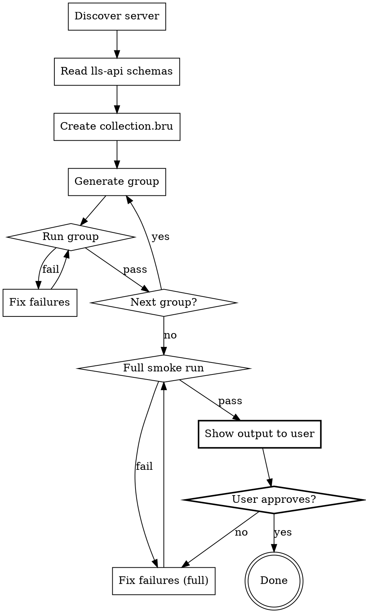

# Generate CRUD Bruno Tests

Create `bruno/lls-crud/` collection from auto-generated `bruno/lls-api/` and a running LLS server.

## Inputs

- `BASE_URL` — server URL (default: `http://localhost:8321`)
- Groups to generate (default: all available)

Model is auto-discovered from the server (`/v1/models`) — pick the first non-embedding model. No need to specify it.

## Hard Gates

**A group is NOT done until its `bru run` passes. The collection is NOT done until the full smoke run passes and the user reviews the output.**



## Red Flags — STOP

These mean you skipped verification:

| Thought | Reality |
|---------|---------|
| "Files are created, we're done" | Files without a passing run prove nothing |
| "The patterns are correct, no need to run" | Run it. Typos, wrong URLs, bad JSON — only `bru run` catches them |
| "I'll run them all at the end" | Run per-group. 6 broken groups at once = debugging nightmare |
| "This group is trivial, skip the run" | Trivial groups break too. 2 seconds to verify |
| "The smoke run is just a formality" | It catches cross-group issues (variable conflicts, ordering) |
| "I can commit and the user will test" | Show the smoke run output FIRST. User reviews BEFORE commit |

### Step 1: Discover

```bash
# Available APIs/providers
curl -s ${BASE_URL}/v1/providers | python3 -m json.tool

# Available models — pick first non-embedding model for inference tests
curl -s ${BASE_URL}/v1/models | python3 -c "
import sys, json
models = json.load(sys.stdin)['data']
for m in models:
    meta = m.get('custom_metadata', {})
    if meta.get('model_type') != 'embedding':
        print('MODEL:', m['id']); break
"
```

Map provider APIs to CRUD groups. Only generate tests for APIs the server actually supports. Auto-detect the inference model — do not ask the user for it.

### Step 2: Read Schemas

For each group, read the corresponding `bruno/lls-api/<Group>/` folder. The generated `.bru` files show exact URLs, methods, and request body fields. Use these as the source of truth — do NOT guess endpoints.

### Step 3: Create Collection

```
bruno/lls-crud/
  collection.bru        ← baseUrl variable
  NN-group/
    folder.bru          ← optional folder meta
    Action Resource.bru  ← test files
```

`collection.bru`:
```bru
meta {
  name: LLS CRUD
}

auth {
  mode: none
}

vars:pre-request {
  baseUrl: http://localhost:8321
}
```

### Step 4: Generate Group → Run → Fix → Next

**Priority order** (skip groups not supported by server):

| NN | Group | Key endpoints | Variable chain |
|----|-------|--------------|----------------|
| 01 | admin | version, health, providers, routes | none |
| 02 | models | list, get by `{{model}}` | none |
| 03 | inference | chat completion with `{{model}}` | none |
| 04 | files | create → list → get → delete | `file_id` |
| 05 | vector-stores | create → list → get → delete | `vector_store_id` |
| 06 | responses | create → list → get | `response_id` |

**Rules from AGENTS.md:**
- `{{baseUrl}}` (camelCase) for server URL
- `{{model}}` for inference model
- `seq` in meta controls order within folder
- `bru.setEnvVar()` to chain IDs between requests
- Always assert status codes and response shape
- Never assert timestamps, UUIDs, or env-specific values

**For each group, immediately after generating its files:**

```bash
cd bruno/lls-crud && npx --prefix .. bru run NN-group -r \
  --env-var baseUrl=${BASE_URL} --env-var model=<discovered-model>
```

**GATE: Do NOT move to the next group until the current one passes.** Fix failures first:
- Wrong request body shape → re-read `lls-api/` schema
- 405 Method Not Allowed → endpoint doesn't support that method, remove or adjust
- Socket hang up → server can't handle the request, skip or adjust

### Step 5: Full Smoke Run

After ALL groups pass individually, run the entire collection:

```bash
cd bruno/lls-crud && npx --prefix .. bru run . -r \
  --env-var baseUrl=${BASE_URL} --env-var model=<discovered-model>
```

**GATE: This must pass.** If it fails, fix and re-run until green.

### Step 6: Show Output → User Reviews → Then Commit

**GATE: Do NOT commit or claim completion.** Instead:

1. Show the full smoke run output to the user
2. Summarize: total requests, passed, failed, any skipped groups
3. Ask the user to review and approve
4. Only commit after user says yes

## Quick Reference: .bru Assertion Patterns

```javascript
// Status check
test("Status is 200", function() {
  expect(res.getStatus()).to.eql(200);
});

// Multiple valid statuses
test("Status is 200 or 201", function() {
  expect([200, 201]).to.include(res.getStatus());
});

// Response shape
test("Has data array", function() {
  const body = res.getBody();
  expect(body).to.have.property("data");
  expect(body.data).to.be.an("array");
});

// Save ID for chaining
test("ID saved", function() {
  const body = res.getBody();
  expect(body.id).to.be.a("string");
  bru.setEnvVar("file_id", body.id);
});
```
